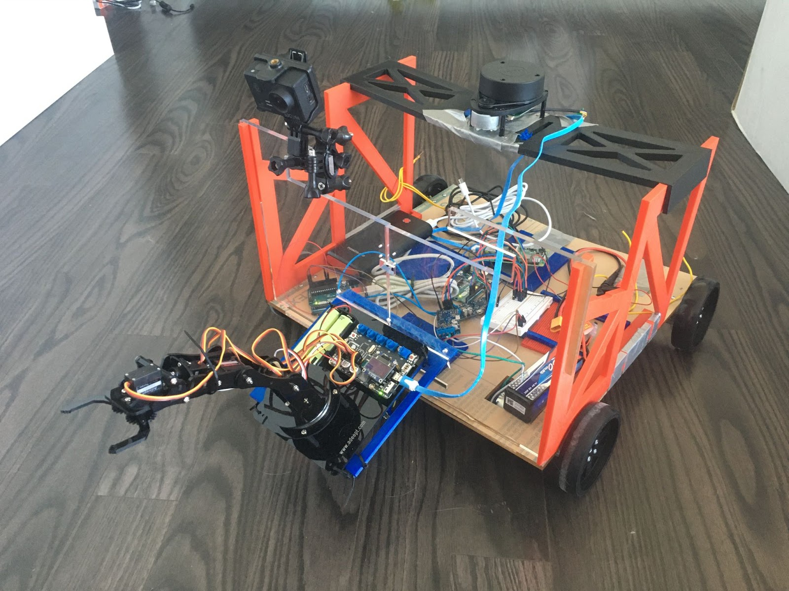
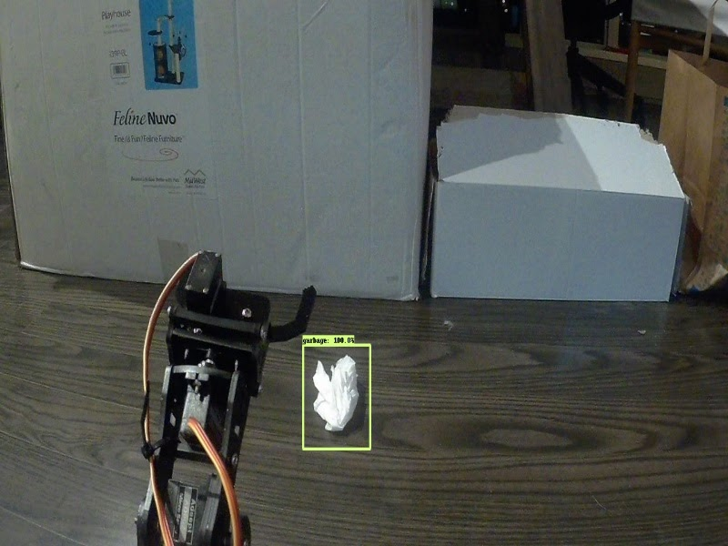

# Automatic Waste Segregator
Designed and built a self-driving robot with a robotic arm to collect and sort the litter using the Robot Operating System (ROS).
 
Team: Nathan D Silva, Shawn Joseph, Shivang Srivastava, Zihua Tan

  
  

 Robot CAD Design(left) and Real Robot(right)

# Demos
**Self-driving System**
 
Implemented the self-driving system using ROS Navigation stack and Exploration package.
 
1. Exploration

  
  

 
2. Obstacle avoidance

  

 

**Object tracking System**
 
Implemented object tracking system with a Time-of-Flight sensor and a camera to track and collect the litter.
 
Used TensorFlow Object Detection API to identify the litter.
 

  
  

 Object tracking system demo(left) and Object Detection result(right)

 

***Youtube link***
 

